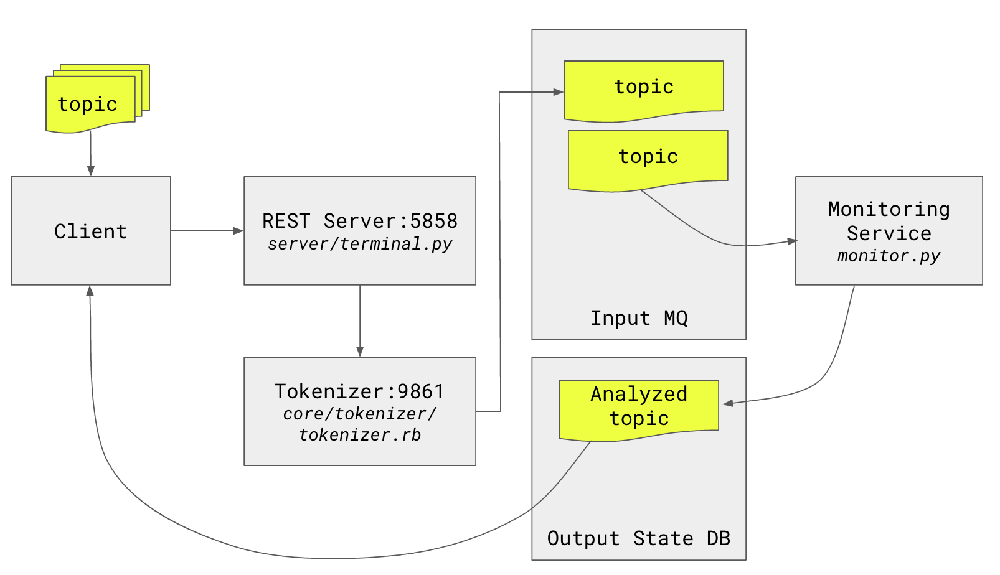

# Pantip-Libr

Pantip librarian!

---

## What is Pantip?

[Pantip](http://www.pantip.com) is the biggest online Q&A community 
in Thailand founded in 1996. Pantip stores a very large 
user-generated questions and answers in numberous topics, 
e.g., lifestyle, health, tradings, technologies, sciences, 
sports, movies, and lots of others. 

---

## What does this do?

Pantip Librarian downloads and analyses a bulk of 
Pantip's user-generated questions and answers with 
text mining techniques. The ultimate purpose (experimentally) 
of the project is to extract and capture potential 
patterns which make the question popular or 
negatively reacted by the users.

---

## Prerequisites

Before running the tasks, these dependencies need to me met:

- [x] [Python 3.4+](https://www.python.org/download/releases/3.4.3/)
- [x] [Apache CouchDB](http://couchdb.apache.org/)
- [x] [Apache Spark](http://spark.apache.org/)
- [x] [Ruby 2.1+](https://www.ruby-lang.org/en/news/2015/08/18/ruby-2-1-7-
released/)
- [x] [RabbitMQ](https://www.rabbitmq.com)

Make sure you have all above prerequisites installed, up and running.

---

## Prepare development environment

Suppose you have all major dependencies as listed in the previous 
section installed properly. Now you can simply run the script 
to install all development dependencies:

```bash
$ bash dev-setup.sh
```

The script basically collects and installs all Python libraries you 
need for running the library.

---

## Try it

`Pantip-Libr` is not a complex module so hopefully you can have a 
speedy first step. Following is the list of common tasks you can 
find.

---

### 1. Download Pantip threads

We have a script to fetch Pantip topics (in a specified range of IDs) 
and store them in a certain format in `CouchDB` on your local machine. 
Simply run the following command:

```
$ ./fetch
```

The script will download series of Pantip threads in the 
specified range of topic IDs and store them in the `CouchDB`.

**Caveat**: Please accept my apology. The download script doesn't 
guard against HTTP connection failures. If network glitch happens, 
the script poorly ends execution.

---

### 2. Process the downloaded threads

To process the downloaded threads, execute the following 
command. (You may notice that `fetch.py` should implicitly 
be triggered at least once before calling this.)

```
$ ./process
```

The script spawns several child processes to do the feature vectorisation, 
classification, and other processing tasks. Basically, the entire 
process will take some time to finish.

**Hint**. The subprocesses leave its access logs in the root directory 
of the repo.

**Steps of operation**

| #step | script | role |
|----|----|----|
| 1 | core/process.py | Tokenise the downloaded records and push to MQ
| 2 | core/textprocess.py | Takes the dataset out of MQ and runs machine learning


---

## Analysis Services



To process any seen or unseen topic with the trained 
models, you need to start analysis services by:

```bash
$ ./start_server
```

The command will execute the following services.

- **MQ Monitor service** (monitor.py)
- **REST server** (server/terminal.py)

To end the process, do it manually (for the time being).

---

## How it got so far?

Still in experimental phase. 
The training time is painful and the models are 
too huge (over 4GB ...). Yet the accuracy still 
needs improvement.


**Hashing with Truncated SVD : 4000 samples**

 DIM | K | TAG |% Total|  Class=0  |  Class=1  |  Class=10 |  Class=-1 
----|---|------|-------|----------|------------|------|-----
1000| 3 | 1024| 62.83 | 80.73 |  0.82 | 51.92 | 31.25 
1000| 3 | 512 | 63.25 | 78.92 |  8.60 | 51.92 | 68.75 
1000| 3 | 256 | 63.45 | 78.65 | 10.60 | 51.92 | 62.50 
1000| 3 | 128 | 62.88 | 78.55 |  8.01 | 51.92 | 75.00 
1000| 3 |  64 | 62.15 | 70.31 | 34.28 | 52.88 | 56.25 
1000| 3 |  32 | 60.23 | 68.39 | 32.04 | 50.00 | 75.00 


**Hashing with LDA : 4000 samples**

 DIM | K | TAG | % Total |  Class=0  |  Class=1  |  Class=10 |  Class=-1
----|---|-----|---------|-------|-------|-------|-------|----
 30 | 3 |  32 |  58.12  | 71.13 | 15.19 | 32.69 | 37.50 |
 20 | 3 |  32 |  57.23  | 68.23 | 21.44 | 31.73 | 37.50 |
 10 | 3 |  32 |  61.12  | 74.33 | 17.79 | 33.65 | 37.50 |

## Caveat

The process takes slightly high computational power. 
It probably breaks on some workstations due to 
computational capability shortage. YMMV.

---


## Significant 3rd parties

These are our brilliant prerequisites.

- [x] [Thailang4r](https://github.com/veer66/thailang4r)

---

## Licence

<a rel="license" href="http://creativecommons.org/licenses/by/4.0/"></a><br /><span xmlns:dct="http://purl.org/dc/terms/" property="dct:title">pantip-libr</span> by <span xmlns:cc="http://creativecommons.org/ns#" property="cc:attributionName">starcolon</span> is licensed under a <a rel="license" href="http://creativecommons.org/licenses/by/4.0/">Creative Commons Attribution 4.0 International License</a>.

The module `pantip-libr` is distributed under 
Creative Commons 4.0 licence. Forking, modification, 
redistribution are welcome.

